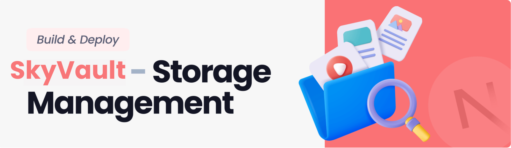

<div align="center">
<br />

<br />

<div>
    
    
    
    
</div>

<h3 align="center">Storage and File Sharing Platform</h3>
</div>

## 📋 <a name="table">Table of Contents</a>
1. 🤖 [Introduction](#introduction)
2. ⚙️ [Tech Stack](#tech-stack)
3. 🔋 [Features](#features)
4. 🤸 [Quick Start](#quick-start)

## <a name="introduction">🤖 Introduction</a>

A storage management and file sharing platform that lets users effortlessly upload, organize, and share files. Built with the latest Next.js 15 and the Appwrite Node SDK, utilizing advanced features for seamless file management.

## <a name="tech-stack">⚙️ Tech Stack</a>

- React 19
- Next.js 15
- Appwrite
- TailwindCSS
- ShadCN
- TypeScript

## <a name="features">🔋 Features</a>

👉 **User Authentication with Appwrite**: Implement signup, login, and logout functionality using Appwrite's authentication system.

👉 **FIle Uploads**: Effortlessly upload a variety of file types, including documents, images, videos, and audio, ensuring all your important data.

👉 **View and Manage Files**: Users can browse through their uploaded files stored in Appwrite storage, view on a new tab, rename file or delete.

👉 **Download Files**: Users can download their uploaded files giving them instant access to essential documents.

👉 **File Sharing**: Users can easily share their uploaded files with others, enabling collaboration and easy access to important content.

👉 **Dashboard**: Gain insights at a glance with a dynamic dashboard that showcases total and consumed storage, recent uploads, and a summary of files grouped by type.

👉 **Global Search**: Users can quickly find files and shared content across the platform with a robust global search feature.

👉 **Sorting Options**: Organize files efficiently by sorting them by date, name, or size, making file management a breeze.

👉 **Modern Responsive Design**: A fresh and minimalist UI that emphasizes usability, ensuring a clean aesthetic across all devices.

and many more, including the latest **React 19**, **Next.js 15** and **Appwrite** features alongside code architecture and
reusability

## <a name="quick-start">🤸 Quick Start</a>

Follow these steps to set up the project locally on your machine.

**Prerequisites**

Make sure you have the following installed on your machine:

- [Git](https://git-scm.com/)
- [Node.js](https://nodejs.org/en)
- [npm](https://www.npmjs.com/) (Node Package Manager)

**Cloning the Repository**

```bash
git clone https://github.com/atomhudson/skyvault.git
cd skyvault
```

**Installation**

Install the project dependencies using npm:

```bash
npm install
```

**Set Up Environment Variables**

Create a new file named `.env.local` in the root of your project and add the following content:

```env
NEXT_PUBLIC_APPWRITE_ENDPOINT=""
NEXT_PUBLIC_APPWRITE_PROJECT=""
NEXT_PUBLIC_APPWRITE_DATABASE=""
NEXT_PUBLIC_APPWRITE_USERS_COLLECTION=""
NEXT_PUBLIC_APPWRITE_FILES_COLLECTION=""
NEXT_PUBLIC_APPWRITE_BUCKET=""
NEXT_APPWRITE_KEY=""
```

Replace the values with your actual Appwrite credentials. You can obtain these credentials by signing up &
creating a new project on the [Appwrite website](https://appwrite.io/).

## 🛠️ Setting up Appwrite Credentials

To run this project, you need to configure Appwrite and obtain the required environment variables.

### 1. Create an Appwrite Project

1. Go to [Appwrite Console](https://cloud.appwrite.io/) (or your self-hosted Appwrite instance).
2. Click **Create Project** → give it a name (e.g., `SkyVault`) and select your platform (Web → `http://localhost:3000`).
3. Once created, copy the **Project ID** and **Project Name**.

    * 🔑 Use them in:

      ```env
      NEXT_PUBLIC_APPWRITE_PROJECT_ID="your-project-id"
      NEXT_PUBLIC_APPWRITE_PROJECT_NAME="SkyVault"
      ```

---

### 2. Get Your API Endpoint

* Go to your project’s **Settings → API** tab.
* Copy the **Endpoint URL** (e.g., `https://cloud.appwrite.io/v1`).
* **Endpoint URL** may very region-to-region.
    * 🔑 Add it to:
      ```env
      NEXT_PUBLIC_APPWRITE_ENDPOINT="https://cloud.appwrite.io/v1"
      ```
---

### 3. Create a Database
1. In the sidebar, go to **Database → Create Database**.
2. Name it (e.g., `skyvault_db`) and copy the **Database ID**.
    * 🔑 Add it to:
      ```env
      NEXT_PUBLIC_APPWRITE_DATABASE="your-database-id"
      ```
---

### 4. Create Collections (Tables)

#### a) Users Collection
1. Inside your database → click **Add Collection** → name it `users`.
2. Configure attributes like `name`, `email`, `avatar`, etc.
3. Copy the **Collection ID**.
    * 🔑 Add it to:
      ```env
      NEXT_PUBLIC_APPWRITE_USERS_TABLE="users-collection-id"
      ```
#### b) Files Collection
1. In the same database, create another collection → name it `files`.
2. Add attributes like `fileId`, `name`, `size`, `type`, `ownerId`.
3. Copy the **Collection ID**.
    * 🔑 Add it to:
      ```env
      NEXT_PUBLIC_APPWRITE_FILES_TABLES="files-collection-id"
      ```
---
### 5. Create a Storage Bucket
1. Go to **Storage → Create Bucket**.
2. Name it (e.g., `skyvault_bucket`).
3. Enable permissions for authenticated users to **read/write**.
4. Copy the **Bucket ID**.

    * 🔑 Add it to:

      ```env
      NEXT_PUBLIC_APPWRITE_BUCKET="your-bucket-id"
      ```

---

### 6. Generate an API Key

1. Go to **Project Settings → API Keys → Create API Key**.
2. Select the required scopes:

    * Databases (read, write, delete)
    * Storage (create, read, delete)
    * Users (read, write, update)
3. Copy the **Secret API Key**.

    * 🔑 Add it to:

      ```env
      NEXT_PUBLIC_APPWRITE_KEY="your-secret-api-key"
      ```

⚠️ Never expose this key on the client! Use it only on the server side.

---

### ✅ Final `.env.local` Example

```env
NEXT_PUBLIC_APPWRITE_PROJECT_ID="your-project-id"
NEXT_PUBLIC_APPWRITE_PROJECT_NAME="SkyVault"
NEXT_PUBLIC_APPWRITE_ENDPOINT="https://cloud.appwrite.io/v1"
NEXT_PUBLIC_APPWRITE_DATABASE="your-database-id"
NEXT_PUBLIC_APPWRITE_USERS_TABLE="users-table-id"
NEXT_PUBLIC_APPWRITE_FILES_TABLES="files-table-id"
NEXT_PUBLIC_APPWRITE_BUCKET="your-bucket-id"
NEXT_PUBLIC_APPWRITE_KEY="your-secret-api-key"
```
**Running the Project**

```bash
npm run dev
```

Open [http://localhost:3000](http://localhost:3000) in your browser to view the project.